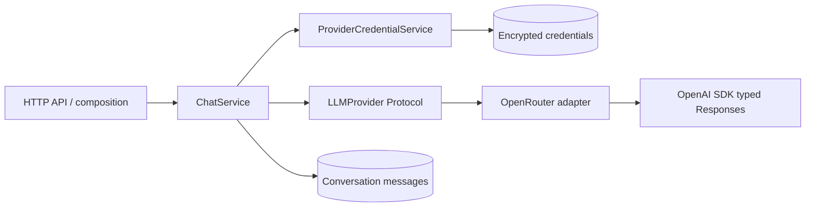

# AI Workspace

A BYOK multi-model chat backend built with FastAPI, SQLAlchemy and PostgreSQL.
V1 supports OpenRouter with a user's encrypted API key and non-streaming text chat.

## Local development

Requires Python 3.14+, uv and PostgreSQL. Install the locked dependencies with
`uv sync --locked`, then copy `.env.example` to `.env` and configure:

- `AI_WORKSPACE_DATABASE_URL`: a PostgreSQL URL using the `asyncpg` driver.
- `AI_WORKSPACE_JWT_SECRET_KEY`: a random secret of at least 32 characters.
- `AI_WORKSPACE_CREDENTIAL_ENCRYPTION_KEY`: a separate key generated with
  `cryptography.fernet.Fernet.generate_key()`. Keep it stable to decrypt saved keys.

Run `uv run alembic upgrade head`, then
`uv run uvicorn ai_workspace.main:app --reload`. Interactive API documentation is
available at `/docs`, and `/health` reports application health.

Register through `POST /users/register`, sign in through `POST /auth/login`, and
use the returned Bearer token for authenticated requests. Save an OpenRouter key
with `PUT /providers/openrouter` using only an `api_key` field. Create a conversation
with `POST /conversations`, then send `model` and `content` to
`POST /conversations/{conversation_id}/chat`.

Include the optional `reasoning_effort` field to select reasoning effort for a turn:

```json
{
  "model": "openai/o4-mini",
  "content": "Explain why this algorithm works.",
  "reasoning_effort": "high"
}
```

Accepted values are `none`, `minimal`, `low`, `medium`, `high`, `xhigh` and `max`.
Omitting the field or sending `null` uses the model's default; the string `"none"`
requests no reasoning. The choice applies only to the current request and is not
saved as a conversation preference. Invalid values return 422. Supported levels
depend on the selected model; see OpenRouter's
[reasoning options](https://openrouter.ai/docs/guides/best-practices/reasoning-tokens).

## LLM boundary



`ChatService.complete_turn()` checks conversation ownership, looks up the user's
credential using the injected provider's `provider_id`, decrypts it for the call,
and supplies the message history to `generate()`. It persists the user and assistant
messages in one database transaction after generation succeeds. Repositories flush;
services own commits and rollbacks.

The protocol exposes only `provider_id` and asynchronous `generate()`. Inputs and
outputs are project-owned `ModelMessage`, `ModelResponse` and `TokenUsage` values.
SDK objects and exceptions stay inside the adapter. The only implemented
`ProviderId` is `openrouter`; fixed credential routes choose it server-side.
An OpenRouter model name such as `openai/...` does not select a different credential.

The HTTP Chat contract accepts `model`/`content` and optional `reasoning_effort`,
and returns `content`/`model`/`usage`.
Missing provider credentials return a safe 400; upstream failures return a safe 502.
The adapter rejects unusable text, invalid model values, embedded upstream errors
and responses reflecting the current key. It preserves valid text whitespace.

Usage is optional display information, not a billing ledger. Missing counts remain
unknown, without filling zeros or inferring totals. The adapter accepts SDK numeric
normalization, including values already coerced to integers. Malformed usage is
discarded as `null` without discarding a valid answer.

## Stateless Responses for V1

The OpenRouter adapter uses the official OpenAI Python SDK's typed
`responses.create()` method at `https://openrouter.ai/api/v1/responses`, with
`store=False` and `stream=False`. Every request supplies the complete PostgreSQL
message history and the new user message; no `previous_response_id` or provider
conversation is used. This follows OpenRouter's
[stateless contract](https://openrouter.ai/docs/api_reference/responses/overview)
and [OpenAI's Responses direction](https://developers.openai.com/api/docs/guides/migrate-to-responses).

When selected, `reasoning_effort` maps to the Responses API's `reasoning.effort`.
When omitted or null, the adapter omits `reasoning` from the upstream request.
See OpenRouter's [Responses reasoning configuration](https://openrouter.ai/docs/api_reference/responses/reasoning).

The adapter maps system/user messages to `input_text` items and assistant history
to `output_text` messages. OpenRouter
[requires assistant history to include id and status](https://openrouter.ai/docs/api_reference/responses/basic-usage),
so the adapter assigns IDs unique within each request and `status="completed"`.
These are local item identifiers, not persisted provider response IDs.

The SDK's `Response.output_text` aggregates output text in order, preserving
whitespace. Only completed responses without an error or incomplete details are
accepted; missing usable text is an error. `Response.model` maps to the project
model field, and `ResponseUsage.input_tokens`, `output_tokens` and `total_tokens`
map to `TokenUsage.prompt_tokens`, `completion_tokens` and `total_tokens`.
OpenRouter can omit usage detail objects that the SDK schema marks required; the
adapter uses the SDK's permissive typed parsing and validates only the project
contract, without re-parsing raw JSON or enforcing the entire OpenAI schema.

ChatService and the provider-neutral types do not depend on Responses. There is
no Chat Completions implementation or fallback. This mapping was checked against
the locked OpenAI SDK 3.22.1 and official documentation on 2026-10-03.

## Credentials and client lifecycle

- Keys are Fernet-encrypted at rest and scoped by the unique `(user_id, provider)`
  pair. Credential responses contain metadata only. Validation failures use a
  fixed response to avoid echoing submitted secrets.
- The OpenRouter endpoint is fixed by the adapter. Public credential requests no
  longer accept `base_url`, and responses no longer return it. The nullable database
  column remains legacy storage only; old values are ignored and new rows use null.
- Each generation owns and closes its SDK client. The explicit BYOK Authorization
  header overrides SDK ambient authorization, redirects are disabled, the SDK
  timeout is 60 seconds per operation, and SDK retries are disabled.
- The application limits `openai`, `httpx2`, `httpcore2` and existing child loggers
  to WARNING after SDK imports. Do not re-enable verbose SDK/transport logging or
  log raw upstream objects: they can contain sensitive headers and exception data.
  This is an application logging policy, not a general-purpose redaction system.

V1 does not implement streaming, retries/fallback, client caching, provider
registries, capability resolution, RAG or agents. It retains a read transaction
during generation and does not serialize concurrent turns on the same conversation.
Revisit transaction duration, cancellation and turn ordering when designing SSE.
A failed database commit cannot undo an already billed model request.

## Verification

Run `uv run ruff check src tests` and `uv run ruff format --check src tests`.

The full test suite needs a **dedicated test PostgreSQL database**, with
`AI_WORKSPACE_DATABASE_URL` pointing to it. Apply `uv run alembic upgrade head` to
that test database, then run `uv run pytest -q`. Integration tests use outer rollback
transactions and savepoints; do not use a production database for testing.

Provider tests run the real SDK over MockTransport with dummy keys and make no live
model calls. They cover typed mapping, error isolation, usage degradation, no
redirects/retries, concurrent BYOK isolation and cancellation cleanup. ChatService
tests use FakeProvider for business/transaction behavior and retain one real-adapter
wiring test. A separate process verifies application logging with `OPENAI_LOG=debug`
and a reflected key in the upstream request-ID header.

For checks without PostgreSQL, run:

```text
uv run pytest -q tests/test_openrouter_provider.py tests/test_provider_logging.py tests/test_chat_api.py tests/test_provider_credential_api.py tests/test_provider_credential_service.py tests/test_encryption.py
```

No live OpenRouter compatibility claim is made by these mocked tests. A real
smoke test must still verify the intended model's Responses support, assistant
history with locally assigned item IDs, multi-turn context, returned text/usage
and upstream error shapes.
