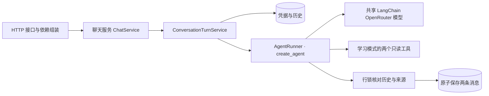

# AI Workspace

一个面向 AI 与编程的技术探索、分析与个人学习工作台。后端使用 FastAPI、SQLAlchemy 和
PostgreSQL，前端使用 React、TypeScript 和 Vite，支持用户自带 OpenRouter API 密钥（BYOK）。
公共 PyPI 月度榜单无需登录；个人助手与学习地图在登录后使用。
普通助手可选接入独立 AA MCP，查询和比较模型评测快照；模型排行榜页面、历史趋势与工具目录作为后续扩展。

榜单读取真实月度快照，在版本化的 20 个精选包目录中分类、筛选和排序；缺失数据保持未知。
网页和普通聊天的 Agent 工具共用同一套排行榜服务，浏览页面不调用模型。
来源、统计口径、缓存与启动说明见 [PyPI 排行榜](docs/pypi-rankings.md)。
AA 的两个只读工具及本地配置见 [AA MCP 接入](docs/aa-mcp.md)；默认关闭，配置后由模型按需调用。

学习地图展示 Notion 学习库的分类、状态、进度与笔记。从 FastAPI 卡片进入同一套会话界面，
LangChain Agent 读取个人进度和三个受控官方章节，讲解、引用来源并保存对话。
地图读取不调用模型；Notion 写回尚未实现。
普通聊天和学习模式共用一套 Agent 运行链路；普通会话可查询公共榜单和已配置的 AA MCP，学习模式按会话上下文启用资料读取工具。
使用与技术导读见 [统一 Agent 运行链路](docs/agent-runtime.md)、[学习地图](docs/learning-map.md)、
[学习 Agent](docs/learning-agent.md)、[学习资料读取](docs/learning-sources.md)，
整体方向见 [学习 Agent 计划](docs/learning-agent-plan.md)。

## 线上使用与部署

- [打开 AI Workspace](https://ai-workspace-production-f76f.up.railway.app/)
- [部署、发布、费用控制与备份恢复说明](docs/deployment.md)

私人功能采用邀请码注册。注册后登录，在页面中保存自己的 OpenRouter 密钥，再创建会话并选择模型。
生产环境由同一个 HTTPS 服务提供首页、静态资源和 `/api/...` 接口。
本地开发使用下文的 Vite 代理和独立后端入口。

## 本地开发

需要 Python 3.14+、uv、PostgreSQL，以及 Node.js 22.12+（生产构建使用 Node.js 24）。
先安装锁定版本的依赖，将 `.env.example` 复制为 `.env`，再设置以下变量：

| 变量 | 用途 |
| --- | --- |
| `AI_WORKSPACE_DATABASE_URL` | PostgreSQL 连接地址，支持 `postgresql+asyncpg://`、`postgresql://` 和 `postgres://`，后端统一使用 asyncpg。 |
| `AI_WORKSPACE_JWT_SECRET_KEY` | 至少 32 字符的随机登录签名密钥。 |
| `AI_WORKSPACE_CREDENTIAL_ENCRYPTION_KEY` | 用 `cryptography.fernet.Fernet.generate_key()` 单独生成的加密主密钥；保留原值才能解密已保存的用户密钥。 |
| `AI_WORKSPACE_REGISTRATION_INVITE_CODE` | 生产环境必填的独立随机邀请码，至少 32 字符；本地开发可不设置。 |

在项目根目录启动后端：

```powershell
uv sync --locked
uv run alembic upgrade head
uv run uvicorn ai_workspace.main:app --host 127.0.0.1 --port 8000 --reload
```

本地接口文档位于 <http://127.0.0.1:8000/docs>，`/health` 返回应用健康状态。
生产环境关闭交互式接口文档，并使用 `/readyz` 检查数据库是否可用。

另开终端启动前端：

```powershell
cd frontend
npm ci
npm run dev
```

打开 <http://127.0.0.1:5173>。Windows 若限制运行 `npm.ps1`，可使用 `npm.cmd`
代替 `npm`，无需修改 PowerShell 安全策略。

1. 默认进入公共 PyPI 榜单，无需登录。首次读取会获取真实上游数据；也可先运行
   `uv run python scripts/refresh_pypi_rankings.py`。
2. 选择 1–3 个包并点击“让助手比较”；登录后只创建普通会话、预填问题，不自动发送。
3. 注册账号，再使用同一邮箱和密码登录；启用邀请注册时填写邀请码。
4. 在“账户与设置”中保存 OpenRouter API 密钥，再在助手中选择支持工具调用的模型，
   例如已实测的 `openai/gpt-6-luna`。点击发送后才产生模型调用。
5. 从侧栏打开学习地图；配置 Notion 后读取真实记录，也可显式选择虚构的演示数据。
   点击 FastAPI 的“继续学习”进入同一套助手，学习来源与对话历史保存于数据库。

模型输入框的下拉项是示例，可直接输入其他 OpenRouter 模型 ID。
后端没有模型列表接口；是否可用取决于账号权限和模型。
页面发送时只提交 `model` 和 `content`，使用后端默认推理设置。

浏览器统一请求 `/api/...`；`frontend/vite.config.ts` 将本地请求转发到
`http://127.0.0.1:8000` 并移除 `/api` 前缀，因此无需额外配置 CORS。
本地前后端都只监听回环地址，后端端口变化时需同步修改 Vite 代理目标。

### 前端构建与预览

```powershell
cd frontend
npm run build
npm run preview
```

预览地址为 <http://127.0.0.1:4173>，预览时也需要后端运行。
开发服务器和构建预览均有本地代理；仓库的生产 Docker 镜像由后端直接提供 `dist/` 和 API。
如果单独托管静态 `dist/`，需自行配置 `/api` 反向代理。
配置参考：[Vite 代理文档](https://vite.dev/config/server-options#server-proxy)、
[Vite 环境变量文档](https://vite.dev/guide/env-and-mode)。

## 代码导读

| 目录或文件 | 作用 |
| --- | --- |
| `src/ai_workspace/api/` | HTTP 路由、鉴权依赖和安全错误响应。 |
| `src/ai_workspace/services/` | 注册、登录、凭据和聊天业务；负责事务提交与回滚。 |
| `src/ai_workspace/repositories/` | 数据库读写；执行 `flush`，由调用方决定事务何时提交。 |
| `src/ai_workspace/models/`、`schemas/` | 分别定义数据库模型和接口请求／响应结构。 |
| `src/ai_workspace/agents/` | 共享 AgentRunner，使用同一套 `create_agent` 执行普通与学习模式。 |
| `src/ai_workspace/providers/` | 通用消息类型和 LangChain OpenRouter 模型工厂，管理凭据、客户端与安全边界。 |
| `src/ai_workspace/learning/` | 学习资料读取、工具、回答结构和来源校验。 |
| `src/ai_workspace/rankings/` | 公共 PyPI 快照、精选目录、缓存刷新和确定性查询排序。 |
| `src/ai_workspace/core/`、`db/` | 配置、密码、JWT、凭据加密和数据库连接。 |
| `src/ai_workspace/production.py` | 生产入口，组合首页、静态资源、API 和就绪检查。 |
| `alembic/` | 数据库迁移，使用与应用一致的连接配置。 |
| `scripts/` | 部署检查、手动真实聊天验证和加密备份工具。 |
| `tests/` | 后端单元测试和 PostgreSQL 集成测试。 |

### 前端组件

前端使用 React 自带的 `useState`、`useEffect`、`useRef` 等 Hooks，
没有额外引入路由器、状态管理库、UI 框架或 Markdown／HTML 渲染器。

| 文件 | 作用 |
| --- | --- |
| `frontend/src/types.ts` | 对应 FastAPI 响应字段，包括可空的 Token 用量。 |
| `frontend/src/api.ts` | 统一 HTTP 请求，设置 Bearer 头、同源路径和安全错误文案；聊天请求不自动重试，401/403 通知应用清理登录状态。 |
| `frontend/src/App.tsx` | 恢复标签页 JWT 后先调用 `/users/me` 验证身份；退出或过期时卸载工作区，清除旧账号数据。 |
| `frontend/src/AuthForm.tsx` | 注册与登录表单；注册成功后切换到登录，提交后清除密码和邀请码。 |
| `frontend/src/CredentialSettings.tsx` | 查看密钥配置状态、保存或删除密钥；提交后立即清空输入，只接收后端返回的元信息。 |
| `frontend/src/Workspace.tsx` | 会话列表、新建和选择会话、选择模型；当前会话和模型按用户 ID 保存在标签页中。 |
| `frontend/src/AppShell.tsx`、`PypiRankings.tsx` | 公共与私人空间导航；真实月度榜单、筛选和进入助手比较。 |
| `frontend/src/LearningMap.tsx` | 学习记录列表、分类与状态筛选、按需读取详情，以及进入 FastAPI 学习会话。 |
| `frontend/src/ChatPanel.tsx` | 读取服务端历史，非流式发送，再读取已落库消息；发送锁防止重复提交，失败时保留草稿。 |
| `frontend/src/session.ts` | 封装 `sessionStorage`；存储不可用时，仍可在当前页面中使用内存登录。 |

刷新时的数据流：读取标签页 JWT → `/users/me` → 会话列表及密钥状态 → 恢复选中的
会话 → `/conversations/{id}/messages`。消息来自数据库，不缓存到浏览器存储。
切换会话时通过 `AbortController` 和组件 `key` 隔离请求，迟到响应不会覆盖新会话。
聊天成功但历史读取失败时，页面会提示“刷新历史，无需重复发送”；
网络异常时也会提示先检查历史，避免重复产生模型调用费用。

## 后端接口

以下为后端入口的路径；生产环境和前端请求均添加 `/api` 前缀。
先注册和登录，再用返回的 Bearer 令牌访问需要登录的接口。

| 方法与路径 | 请求或响应 |
| --- | --- |
| `POST /users/register` | `{email, password, invite_code?}` → 用户信息，201；生产环境必须提供有效邀请码。 |
| `POST /auth/login` | `{email, password}` → `{access_token, token_type}`。 |
| `GET /rankings/pypi` | 无需登录；精选 Python 包月度下载榜，支持搜索、类别和包名筛选。 |
| `GET /users/me` | 当前用户。 |
| `GET /providers/openrouter` | 密钥元信息；未配置时返回 404。 |
| `PUT /providers/openrouter` | `{api_key}` → 元信息；不返回明文或密文密钥。 |
| `DELETE /providers/openrouter` | 成功时返回 204。 |
| `GET /conversations` | 当前用户的会话列表。 |
| `POST /conversations` | `{title, learning_topic?, learning_source?}` → 新会话，201；学习字段须成对提供。 |
| `GET /conversations/{id}/messages` | `[{id, role, content, created_at}]`。 |
| `POST /conversations/{id}/chat` | `{model, content, reasoning_effort?}` → `{content, model, usage}`；学习会话额外返回来源与工具摘要。 |
| `GET /learning/records?source=notion` | 学习地图摘要列表；支持显式 `source=demo`。 |
| `GET /learning/records/{id}?source=notion` | 所属学习库内的一条记录与笔记。 |

读取消息前，`ConversationService.get()` 会检查会话归属，再由
`MessageRepository.list_by_conversation()` 按 `created_at ASC, id ASC` 读取消息。
其他用户的会话和不存在的会话统一返回 404，未登录返回 401；响应禁止缓存。

普通聊天请求可用 `reasoning_effort` 指定本轮推理强度；学习会话目前只接受省略或 `null`：

```json
{
  "model": "openai/o4-mini",
  "content": "请解释这个算法为什么有效。",
  "reasoning_effort": "high"
}
```

可选值为 `none`、`minimal`、`low`、`medium`、`high`、`xhigh` 和 `max`。
省略或传入 `null` 时使用模型默认值；字符串 `"none"` 表示请求关闭推理。
该设置只影响当前请求，不保存为会话偏好。无效值返回 422。
具体支持哪些档位取决于模型，参见 [OpenRouter 推理选项](https://openrouter.ai/docs/guides/best-practices/reasoning-tokens)。

## 模型调用与事务


```mermaid
flowchart LR
    API[HTTP 接口与依赖组装] --> Chat[聊天服务 ChatService]
    Chat --> Turn[ConversationTurnService]
    Turn --> DB[(凭据与历史)]
    Turn --> Runner[AgentRunner · create_agent]
    Runner --> Model[共享 LangChain OpenRouter 模型]
    Runner --> Tools[学习模式的两个只读工具]
    Runner --> Save[行锁核对历史与来源]
    Save --> Messages[(原子保存两条消息)]
```

`ChatService.complete_turn()` 复用 `ConversationTurnService` 检查会话归属、
解密当前用户的密钥、复制历史与学习上下文，再结束读取事务。
两种会话都交给 `AgentRunner.run()`，通过 LangChain `create_agent` 执行。
普通模式提供公开榜单查询工具；FastAPI 学习模式提供读取学习进度和官方章节的工具，并校验回答来源。
生成成功后重新锁定会话，核对历史与上下文没有改变，再原子保存用户和助手两条消息。
仓储层只执行 `flush`，业务服务负责提交与回滚。

`providers/openrouter.py` 的 `open_chat_model()` 是唯一模型工厂，使用 LangChain OpenRouter
集成 `ChatOpenRouter` 调用 Chat Completions。应用消息和用量使用自己的数据结构，
SDK 原始对象与异常不直接进入 HTTP 响应。当前供应商仅为 OpenRouter，凭据由服务端选择。
模型名称中的 `openai/...` 不会切换到另一套供应商凭据。

缺少凭据时返回安全的 400；模型或框架失败转换为固定错误，学习运行超时返回 504。
模型工厂和执行器检查返回内容，拒绝不可用答案及已知凭据回显，不透传上游异常正文。

Token 用量用于页面展示，不作为计费账本。缺失的数值保持未知，不补零、不推算总数。
学习模式汇总本轮多次模型调用；某项计数只在每次调用均提供有效值时求和。

模式不同，限制也不同：普通聊天每次模型调用最多 60 秒，整轮最多 120 秒，最多三次模型调用
和两次排行榜工具调用，不套用学习模式的 2,000 输出 Token 上限；
学习模式每次模型请求最多 45 秒、整轮 Agent 运行最多 120 秒，每次最多 2,000 输出 Token，
最多调用模型五次和资料工具六次。两者都使用非流式回复，推理设置与详细调用链见
[统一 Agent 运行链路](docs/agent-runtime.md)。

PostgreSQL 仍是唯一对话历史来源。每次请求重建执行上下文，没有新增 checkpoint、
供应商侧会话或第二套消息记录。旧版本的 OpenAI Responses 适配器已由共享模型工厂替代。

## 登录、密钥与安全边界

- JWT 保存在当前标签页的 `sessionStorage` 中以支持刷新，不写入 `localStorage`、URL、
  日志或构建配置。退出和鉴权失效时会清除本应用的标签页状态。
- 当前使用 Bearer JWT，没有 HttpOnly Cookie 或刷新令牌接口。同源 JavaScript 可以读取
  `sessionStorage`。聊天消息以 React 纯文本展示，不执行返回的 HTML，也不加载第三方脚本。
- API 密钥通过同源接口提交给后端，表单随后清空，不写入浏览器存储。
  后端使用 Fernet 加密，并以 `(user_id, provider)` 唯一约束隔离用户凭据。
  响应只包含元信息；校验错误使用固定文案，避免回显输入的密钥、密码或邀请码。
- OpenRouter 地址由适配器固定。凭据接口不接受或返回 `base_url`；数据库中的可空列
  仅为历史兼容而保留，旧值不会使用，新记录写入 `null`。
- 每次运行独立创建并关闭模型客户端，显式使用当前用户的 BYOK 密钥。目标地址固定，
  禁止重定向与自动重试，超时和输出上限按模式设置；不通过环境变量启用外部追踪。
- 模型工厂关闭 SDK 调试日志，框架边界清理敏感异常。请勿开启详细 SDK／传输日志，
  或记录上游原始对象，以免暴露请求头、会话和凭据。
- Vite 不加载根目录的后端 `.env`，开发文件服务限制在 `frontend/`。
  不要将真实密钥写入 `VITE_*` 变量或源码。所有 API 请求关闭缓存、拒绝重定向，
  页面只显示预设的安全错误文案。
- 消息表暂不保存模型和 Token 用量，页面仅即时展示本轮信息，刷新后不会补造这些数据。

普通聊天暂不包含流式回复、重试与备用模型、客户端缓存、供应商注册表、能力解析或 RAG。
普通和学习聊天在生成期间均释放读取事务，保存阶段使用行锁与历史／上下文快照检查。
并发冲突返回 409；模型可能已计费，因此先刷新历史再决定是否重发。
数据库提交失败无法撤销已经计费的模型调用，详见学习地图与学习 Agent 文档。

## 验证与测试

运行静态检查和前端测试：

```powershell
uv run ruff check src tests scripts
uv run ruff format --check src tests scripts
cd frontend
npm test
npm run build
```

完整后端测试必须使用**专用 PostgreSQL 测试库**。将 `AI_WORKSPACE_DATABASE_URL`
指向测试库，执行 `uv run alembic upgrade head` 后，再运行：

```powershell
uv sync --locked --group backup
uv run pytest -q
```

集成测试使用外层回滚事务和保存点。请勿把生产库用于测试。
GitHub Actions 使用独立 PostgreSQL 18，同时检查前端、生产镜像以及加密备份镜像的导出与恢复。
2026-11-01 统一运行链路后，后端 **542 项测试通过**，Ruff 检查与格式检查通过。
既有上线记录见 [上线验收说明](docs/deployment.md#上线验收)，地图验证见
[学习地图验证记录](docs/learning-map.md#验证与学习顺序)。

供应商测试使用真实 SDK 配合 `MockTransport` 和虚拟密钥，不发起真实模型请求。
覆盖响应映射、错误隔离、用量缺失、禁止重定向与重试、并发密钥隔离和取消清理。
执行器与模型工厂可注入测试替身；会话测试检查共享事务、归属、历史冲突和上下文绑定。
测试覆盖普通与学习模式的隔离、资源清理、推理参数、部分用量，以及空回答与截断响应。

### 手动真实聊天验证

`scripts/smoke_chat.py` 会产生**两次计费模型调用**。先通过页面注册测试账号，
再将 `.env.example` 末尾的 `AI_WORKSPACE_TEST_*` 填入本地 `.env`。
保持前后端运行，在项目根目录执行：

```powershell
uv run python scripts/smoke_chat.py
```

脚本登录现有测试账号，优先复用已配置密钥，仅在没有密钥时保存指定的测试密钥。
它创建带“前端联调验证”标题的会话，检查两轮上下文、消息顺序和重新登录后的历史一致性。
测试会话会保留供页面查看；脚本只打印安全状态和会话 ID，不输出 JWT 或 API 密钥。
远程生产验证必须使用独立配置文件和 HTTPS，操作方法见[部署说明](docs/deployment.md)。

2026-11-01 使用本地配置的 `openai/gpt-6-luna` 验证共享模型工厂：普通聊天两轮、
重新登录后历史一致性，以及真实 Notion 学习一轮均通过。学习记录与官方文档工具调用成功，
引用、消息保存和学习上下文均核验通过。其他模型的工具调用兼容性仍需单独验证。

## 文档与注释约定

README、操作文档、代码注释和函数说明以中文为主，重点解释用途、设计原因和注意事项。
变量名、函数名、文件名、接口路径、环境变量、数据库字段和机器使用的状态值保留英文。
固定接口错误文本保持兼容，由前端统一映射为中文提示；结构化日志中的状态键和值也保留原样。
产品名称和模型 ID 保持原名，便于查阅官方资料。
